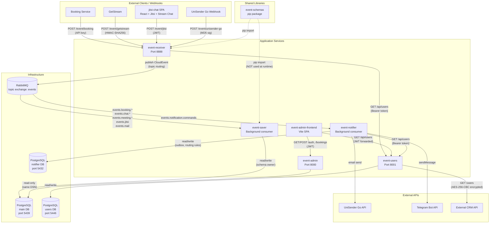

# System Architecture

## System Purpose

An event-driven microservices system for managing bookings, participants, and notifications. External webhook events are ingested, normalized into CloudEvents, routed through RabbitMQ, persisted to PostgreSQL, and projected into materialized views consumed by an admin UI. A separate notification dispatcher fans out to email and Telegram channels.

## Service Inventory

| Service | Purpose | Tech Stack | Maturity |
|---------|---------|-----------|----------|
| event-receiver | HTTP ingress gateway: validates webhooks, normalizes to CloudEvents, publishes to RabbitMQ | Python 3.14, FastAPI, FastStream, Dishka | Pre-production (audit: 4C/5H/9M/6L findings) |
| event-saver | Consumes RabbitMQ queues, deduplicates, persists raw events, builds projection tables | Python 3.14, FastAPI, FastStream, SQLAlchemy 2.x, Alembic, Dishka | Pre-production (audit: 2C/4H/6M/5L findings) |
| event-admin | Read-only API over event-saver's DB for admin UI | Python 3.14, FastAPI, SQLAlchemy 2.x, Dishka | Pre-production (audit: 2C/4H/7M/5L findings) |
| event-admin-frontend | Admin SPA: bookings list, booking details, participants | TypeScript, React 18, Vite | Pre-production (audit: 2C/3H/5M/4L findings) |
| jitsi-chat | Participant-facing video meeting + chat SPA; sends CloudEvents for Jitsi iframe events | TypeScript, React 19, Vite 7, @jitsi/react-sdk, stream-chat | Pre-production |
| event-users | User/contact CRUD with background CRM sync | Python 3.14, FastAPI, SQLAlchemy 2.x, Dishka | Pre-production (audit: 2C/4H/5M/5L findings) |
| event-notifier | Notification fan-out dispatcher: routing rules, outbox, email/Telegram delivery | Python 3.14, FastAPI, FastStream, asyncpg, Dishka | Early/pre-production (audit: 3C/5H/6M/4L findings) |
| event-schemas | Shared Python library: Pydantic models, EventType enum, priorities | Python, Pydantic v2 | Pre-production (not a runtime service) |

## System Topology

**Source:** `docs/audit/DEPENDENCY_GRAPH.md:7-96`

## Key Architectural Decisions

### 1. Why Microservices (not Monolith)

**Rationale:** Independent failure domains. The booking ingestion path (event-receiver + RabbitMQ + event-saver) must remain available even if notifications, admin UI, or user management fail. Each service has different scaling characteristics -- event-receiver handles bursty webhook traffic while event-saver needs steady throughput.

**Evidence:** The minimum viable path for booking receipt requires only 4 components: event-receiver, RabbitMQ, event-saver, PostgreSQL main DB. All other services can fail independently without data loss (`docs/audit/DEPENDENCY_GRAPH.md:200-209`).

### 2. Why RabbitMQ (not Kafka or Direct HTTP)

**Rationale:** Decouples ingestion throughput from processing speed. Event-receiver can accept webhooks at any rate without back-pressure from slow projections. Topic exchange with routing keys provides flexible event routing without producer awareness of consumers. Priority queues (`x-max-priority=10`) ensure booking lifecycle events are processed before chat events.

**Trade-off:** The system currently has no replay capability (unlike Kafka). Once consumed, events exist only in PostgreSQL.

### 3. Why event-receiver Separate from event-saver

**Rationale:** event-receiver is stateless (no DB connection), horizontally scalable, and handles 4 different auth methods (API key, JWT, HMAC, MD5 signature). event-saver is a long-running consumer with projection logic tightly coupled to the DB schema. Separating them allows the ingress gateway to restart independently without interrupting queue consumption.

**Evidence:** event-receiver has no `POSTGRES_DSN` configuration (`event-receiver/docs/SERVICE_OVERVIEW.md:24`).

### 4. Why event-notifier Separate

**Rationale:** Notification fan-out has different reliability semantics (transactional outbox with retries), its own database, and calls external APIs that may be slow or unavailable. Isolating it prevents slow Telegram/email delivery from blocking booking event persistence.

**Evidence:** event-notifier uses asyncpg directly (not SQLAlchemy), has its own DB schema with `routing_rules`, `notification_outbox`, and `processed_events` tables (`event-notifier/event_notifier/db/schema.py`), and polls a transactional outbox for delivery (`event-notifier/docs/SERVICE_OVERVIEW.md:39-52`).

### 5. Why event-admin is Read-Only

**Rationale:** Enforces data ownership -- event-saver is the single writer to the main DB. event-admin exposes only `fetch_one`/`fetch_all` in its `ISqlExecutor` interface (`event-admin/event_admin/adapters/sql.py:11-21`). Schema migrations live exclusively in `event-saver/alembic/`.

**Inconsistency (audit finding):** Despite read-only intent, event-admin uses the same PostgreSQL superuser credentials as event-saver (`postgres`/`postgres`). No database-level role enforcement exists (`docs/audit/AUDIT_REPORT.md:136`).

### 6. Decisions That Look Wrong in Hindsight

| Decision | Problem | Source |
|----------|---------|--------|
| Dual EventType enums | event-schemas defines `"booking.created"` while event-saver defines `"booking.events.v1.booking.created.create"`. The shared library is not shared with its largest consumer. | `event-schemas/event_schemas/types.py:8-43` vs `event-saver/event_saver/event_types.py:20-37` (audit C-9) |
| First-match routing rules | 5 rules for `events.notifications` shadow the intended `events.booking.lifecycle` rules. Booking lifecycle events never reach event-saver's primary queue. | `event-receiver/event_receiver/config.py:9-34` (audit C-1) |
| Queue name mismatch | event-notifier previously subscribed to `events.notifications` while event-receiver publishes `notification.send_requested` to `events.notification.commands`. Resolved: event-notifier now defaults to `events.notification.commands`. | `event-notifier/event_notifier/config.py:18` (audit C-3, resolved) |
| SqlExecutor auto-commit | `execute()` committed after every statement in the original design. Now fixed with `execute_in_transaction()`, but the pattern remains inconsistent across services. | `event-saver/event_saver/adapters/sql.py:18-20` (audit C-5) |
| Same DB credentials for reader and writer | event-admin has full write access despite being architecturally read-only. | `docs/audit/DEPENDENCY_GRAPH.md:150-155` |

## What is Intentionally Out of Scope

- **Event replay / event sourcing** -- Events are persisted but there is no replay mechanism. Recovery relies on webhook re-delivery by external callers.
- **Service mesh / API gateway** -- Services communicate directly via HTTP and RabbitMQ. No Envoy, Istio, or centralized gateway.
- **Multi-tenancy** -- Single-tenant system.
- **Push notifications** -- FCM channel is wired but disabled pending credentials (`event-notifier/event_notifier/config.py:31-32`).
- **Delivery result feedback loop** -- event-notifier was designed to publish `notification.*.message_sent` events back to event-receiver, but this is not implemented (`docs/audit/AUDIT_REPORT.md:439-448`, audit H-19).
- **Automated testing** -- No service has meaningful test coverage (audit L-1).
- **CI/CD pipeline** -- Not present in the repository.

## Known Architectural Concerns

Cross-referenced from `docs/audit/AUDIT_REPORT.md`:

| Concern | Severity | Audit ID | Impact |
|---------|----------|----------|--------|
| Booking lifecycle events routed to wrong queue (data loss) | CRITICAL | C-1 | event-saver never receives booking events via intended path |
| Queue name mismatch breaks notification pipeline | ~~CRITICAL~~ RESOLVED | C-3 | event-notifier now defaults to `events.notification.commands`; queue mismatch fixed |
| SqlExecutor auto-commit breaks atomicity | CRITICAL | C-5 | Partial projection failures leave inconsistent state |
| Hardcoded JWT default secret in production-ready config | CRITICAL | C-6 | Token forgery if env var missing |
| No automated tests across entire system | LOW | L-1 | Routing bugs, broken URLs, syntax errors undetected |
| No DLQ on event-saver consumer | HIGH | H-11 | Poison-pill messages block queue processing |
| event-admin DEBUG=True disables all auth | CRITICAL | C-14 | Committed `.env` file enables bypass |
| FOR UPDATE SKIP LOCKED outside transaction | CRITICAL | C-11 | Duplicate notification deliveries |
| No pagination on booking list API | HIGH | H-14 | Unbounded memory growth |
| Shared JWT secret coupling between services | implicit | -- | event-admin-frontend, event-admin, and event-users must share the same secret |

Full details: `docs/audit/AUDIT_REPORT.md` (86 deduplicated findings: 14 CRITICAL, 24 HIGH, 30 MEDIUM, 18 LOW).
