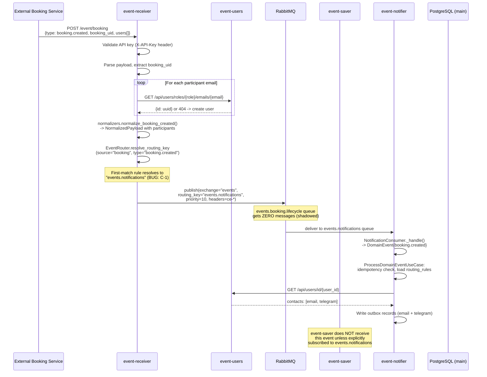
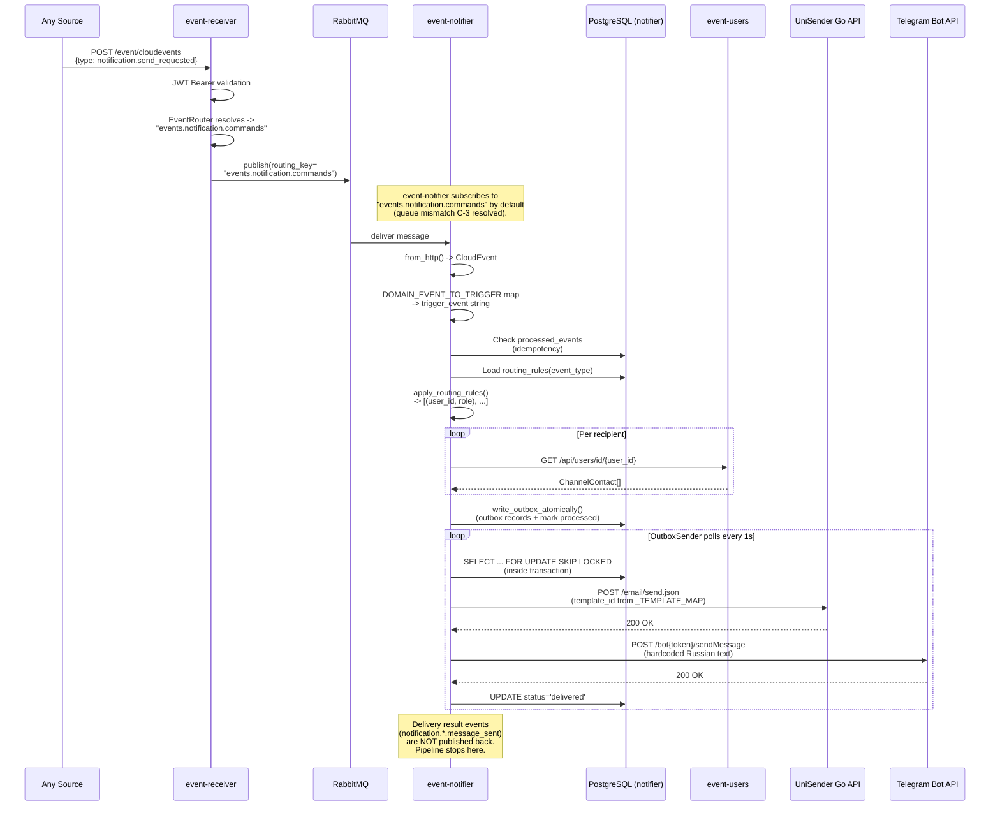

# Message Contracts

## Overview

All inter-service messages use the **CloudEvents specification v1.0** in **binary content mode**:

- **Transport:** AMQP 0.9.1 via RabbitMQ
- **Exchange:** `events` (topic, durable)
- **Routing:** Routing key = queue name; first-match glob pattern rules in event-receiver
- **Headers:** `ce-type`, `ce-source`, `ce-id`, `ce-time`, `ce-booking_id`, `ce-specversion`, `ce-idempotencykey`, `ce-traceid`, `ce-spanid`, `ce-dataschema`
- **Body:** JSON event payload wrapped in `{"original": {...}, "normalized": {"participants": [...]}}`

The `original` key contains the raw source payload unchanged. The `normalized` key contains enriched participant data (with `user_id` UUIDs resolved from event-users). All consumers MUST read source-specific fields from `original`, not from the top-level body.

**Source:** `event-receiver/event_receiver/adapters/publisher.py:89-93`, `event-receiver/event_receiver/normalizers.py:53`

Priority is set via AMQP `priority` property (0-10 scale) using the `EVENT_PRIORITIES` map from event-schemas (`event-schemas/event_schemas/types.py:87-116`).

**Source:** `event-receiver/event_receiver/adapters/publisher.py:67-71`, `event-saver/event_saver/adapters/consumer.py:51-68`

---

## Exchange and Queue Registry

Reformatted from `docs/audit/CONTRACT_MAP.md`.

### Exchanges

| Exchange | Type | Durable | Declared by | Purpose |
|----------|------|---------|-------------|---------|
| `events` | topic | yes | every service (idempotent; full topology by event-receiver) | Primary message exchange for all CloudEvents |
| `events.dlx` | topic | yes | event-receiver AND every consumer (idempotent) | Dead-letter exchange for failed messages |

### Queues (canonical, from `event_schemas.queues.ALL_QUEUES`)

**Single source of truth:** `event-schemas/event_schemas/queues.py`. One queue per consumer
service; fan-out is achieved by binding several queues to the same routing key. Canonical
arguments for every queue (verbatim): `x-max-priority=10`, `x-dead-letter-exchange=events.dlx`,
`x-dead-letter-routing-key=<queue>.dlq`. Every queue has a `<queue>.dlq` companion
(`x-message-ttl=86400000`) bound to `events.dlx`. Consumers declare their own queues + DLQs at
startup; event-receiver declares the full topology.

| Queue | Binding (routing key) | Consumer | Purpose |
|-------|----------------------|----------|---------|
| `events.booking.lifecycle.saver` | `events.booking.lifecycle` | event-saver | Persist booking lifecycle events |
| `events.booking.lifecycle.booking` | `events.booking.lifecycle` | event-booking | Orchestrate chat/meeting/notifications |
| `events.chat.lifecycle` | `events.chat.lifecycle` | event-saver | Chat created/deleted |
| `events.chat.activity` | `events.chat.activity` | event-saver | Chat messages |
| `events.chat` | `events.chat` | event-saver | GetStream webhook events |
| `events.meeting.lifecycle` | `events.meeting.lifecycle` | event-saver | Meeting URL created/deleted |
| `events.notification.commands` | `events.notification.commands` | event-notifier | notification.send_requested commands |
| `events.notification.delivery` | `events.notification.delivery` | event-saver | Delivery result events |
| `events.jitsi` | `events.jitsi` | event-saver | Jitsi meeting events |
| `events.mail` | `events.mail` | event-saver | UniSender status callbacks |
| `events.user.email` | `events.user.email` | event-users | Email change requests |
| `events.unrouted` | `events.unrouted` | event-saver | Unmatched / unknown-type events |

**Removed (audit-v2):** `events.booking.reminder` (no producer, no consumer — reminders go via
`notification.send_requested` with `trigger_event=BOOKING_REMINDER`); `events.notifications`
(legacy phantom queue).

### Canonical data envelope (audit-v2)

Every CloudEvent published by event-receiver carries `data` as
`{"original": <domain payload>, "normalized": {"participants": [{email, role, time_zone, user_id}]}}`.
Typed accessors: `event_schemas.envelope.EventEnvelope` / `unwrap_payload()`. Consumers MUST NOT
read domain fields at the top level. `normalized.participants[].user_id` is the event-users UUID
resolved by the receiver.

### Canonical CloudEvent attributes (audit-v2)

Extension attribute names come from `event_schemas.attributes`: booking identifier is
**`bookingid`** (`ce-bookingid` header) — never `booking_id`/`ce-booking_id`. Also `traceid`,
`spanid`, `idempotencykey`. Unknown event types are published to `events.unrouted` (never a 500).

Payload contracts per type: `event_schemas.mapping.PAYLOAD_MODELS` and
`docs/audit/v2/CONTRACT_DECISIONS.md`.

## Complete Message Type Registry

| CloudEvent `type` | Producer | Consumer | Routing Key (actual) | Priority | Payload Schema |
|-------------------|----------|----------|---------------------|----------|----------------|
| `booking.created` | event-receiver | event-notifier (via `events.notifications`) | `events.notifications` | 10 (CRITICAL) | `BookingCreatedPayload` |
| `booking.rescheduled` | event-receiver | event-notifier | `events.notifications` | 10 (CRITICAL) | `BookingRescheduledPayload` |
| `booking.reassigned` | event-receiver | event-notifier | `events.notifications` | 10 (CRITICAL) | `BookingReassignedPayload` |
| `booking.cancelled` | event-receiver | event-notifier | `events.notifications` | 10 (CRITICAL) | `BookingCancelledPayload` |
| `booking.reminder_sent` | event-receiver | event-notifier | `events.notifications` | 7 (HIGH) | `BookingReminderSentPayload` |
| `booking.rejected` | event-booking (via event-receiver) | event-saver, event-notifier | `events.booking.lifecycle` | 10 (CRITICAL) | `BookingRejectedPayload` |
| `chat.created` | event-receiver | event-saver | `events.chat.lifecycle` | 5 (NORMAL) | `ChatCreatedPayload` |
| `chat.deleted` | event-receiver | event-saver | `events.chat.lifecycle` | 5 (NORMAL) | `ChatDeletedPayload` |
| `chat.message_sent` | event-receiver | event-saver | `events.chat.activity` | 5 (NORMAL) | `ChatMessageSentPayload` |
| `meeting.url_created` | event-receiver | event-saver | `events.meeting.lifecycle` | 5 (NORMAL) | `MeetingUrlCreatedPayload` |
| `meeting.url_deleted` | event-receiver | event-saver | `events.meeting.lifecycle` | 5 (NORMAL) | `MeetingUrlDeletedPayload` |
| `notification.send_requested` | event-booking (via event-receiver) | event-notifier | `events.notification.commands` | 7 (HIGH) | `NotificationCommandPayload` |
| `notification.email.message_sent` | event-notifier (NOT implemented) | event-saver | `events.notification.delivery` | 7 (HIGH) | `EmailNotificationPayload` |
| `notification.telegram.message_sent` | event-notifier (NOT implemented) | event-saver | `events.notification.delivery` | 7 (HIGH) | `TelegramNotificationPayload` |
| `notification.push.message_sent` | event-notifier (NOT implemented) | event-saver | `events.notification.delivery` | 5 (NORMAL) | `PushNotificationPayload` |
| `unisender.events.v1.transactional.status.create` | event-receiver | event-saver | `events.mail` | 5 (NORMAL) | `UniSenderStatusPayload` |
| `getstream.channel.created` | event-receiver | event-saver | `events.chat` | 5 (NORMAL) | `GetStreamEventPayload` |
| `getstream.channel.deleted` | event-receiver | event-saver | `events.chat` | 5 (NORMAL) | `GetStreamEventPayload` |
| `getstream.message.new` | event-receiver | event-saver | `events.chat` | 5 (NORMAL) | `GetStreamEventPayload` |
| `getstream.message.updated` | event-receiver | none | `events.chat` | 5 (NORMAL) | `GetStreamEventPayload` |
| `getstream.message.deleted` | event-receiver | none | `events.chat` | 5 (NORMAL) | `GetStreamEventPayload` |
| `getstream.message.read` | event-receiver | event-saver | `events.chat` | 5 (NORMAL) | `GetStreamEventPayload` |
| `jitsi.conference.joined` | jitsi-chat (via event-receiver) | event-saver | `events.jitsi` | 5 (NORMAL) | `JitsiEventPayload` |
| `jitsi.conference.left` | jitsi-chat (via event-receiver) | event-saver | `events.jitsi` | 5 (NORMAL) | `JitsiEventPayload` |
| `jitsi.participant.joined` | jitsi-chat (via event-receiver) | event-saver | `events.jitsi` | 5 (NORMAL) | `JitsiEventPayload` |
| `jitsi.participant.left` | jitsi-chat (via event-receiver) | event-saver | `events.jitsi` | 5 (NORMAL) | `JitsiEventPayload` |
| `jitsi.participant.muted` | jitsi-chat (via event-receiver) | event-saver | `events.jitsi` | 5 (NORMAL) | `JitsiEventPayload` |
| `jitsi.participant.menu_button_click` | jitsi-chat (via event-receiver) | event-saver | `events.jitsi` | 5 (NORMAL) | `JitsiEventPayload` |
| `jitsi.audio.mute_status_changed` | jitsi-chat (via event-receiver) | event-saver | `events.jitsi` | 5 (NORMAL) | `JitsiEventPayload` |
| `jitsi.video.mute_status_changed` | jitsi-chat (via event-receiver) | event-saver | `events.jitsi` | 5 (NORMAL) | `JitsiEventPayload` |
| `jitsi.speaker.dominant_changed` | jitsi-chat (via event-receiver) | event-saver | `events.jitsi` | 5 (NORMAL) | `JitsiEventPayload` |
| `jitsi.device.list_changed` | jitsi-chat (via event-receiver) | event-saver | `events.jitsi` | 5 (NORMAL) | `JitsiEventPayload` |
| `jitsi.camera.error` | jitsi-chat (via event-receiver) | event-saver | `events.jitsi` | 5 (NORMAL) | `JitsiEventPayload` |
| `jitsi.mic.error` | jitsi-chat (via event-receiver) | event-saver | `events.jitsi` | 5 (NORMAL) | `JitsiEventPayload` |
| `jitsi.error.occurred` | jitsi-chat (via event-receiver) | event-saver | `events.jitsi` | 5 (NORMAL) | `JitsiEventPayload` |
| `jitsi.peer_connection.failure` | jitsi-chat (via event-receiver) | event-saver | `events.jitsi` | 5 (NORMAL) | `JitsiEventPayload` |
| `jitsi.suspend.detected` | jitsi-chat (via event-receiver) | event-saver | `events.jitsi` | 5 (NORMAL) | `JitsiEventPayload` |
| `jitsi.toolbar.button_clicked` | jitsi-chat (via event-receiver) | event-saver | `events.jitsi` | 5 (NORMAL) | `JitsiEventPayload` |
| `user.email.change_requested` | event-admin (via event-receiver `/event/admin`) | event-users | `events.user.email` | 10 (CRITICAL) | `UserEmailChangeRequestedPayload` |
| _(unmatched)_ | event-receiver | event-saver (fallback) | `events.unrouted` | -- | raw payload |

**Source:** `docs/audit/CONTRACT_MAP.md:46-71`, `event-schemas/event_schemas/types.py:8-43`

---

## Event Detail: `user.email.change_requested`

Событие запроса смены email клиента, инициируемое администратором через `event-admin`.

| Атрибут | Значение |
|---------|----------|
| `ce-type` | `user.email.change_requested` |
| `ce-source` | `admin` |
| Queue | `events.user.email` |
| Priority | 10 (CRITICAL) |
| Producer | event-admin (через `POST /event/admin` в event-receiver) |
| Consumer | event-users (FastStream RabbitMQ consumer) |

**Payload schema (`UserEmailChangeRequestedPayload`)**:

```json
{
  "user_id": "uuid",
  "old_email": "old@example.com",
  "new_email": "new@example.com",
  "requested_by": "admin@example.com"
}
```

**Flow**:
1. Admin вызывает `POST /api/users/id/{user_id}/change-email` в event-admin.
2. event-admin публикует CloudEvent в event-receiver `POST /event/admin` (auth: static API key).
3. event-receiver маршрутизирует `admin` / `user.email.*` → `events.user.email`.
4. event-users потребляет событие: обновляет `users.email`, создаёт запись в `user_email_changelog`, устанавливает `email_source='admin'`.
5. Webhook outbox доставляет изменение в CRM; после успешной доставки сбрасывает `email_source='crm'`.

**CRM sync protection**: поле `email_source='admin'` блокирует перезапись email при следующей синхронизации с CRM до тех пор, пока outbox не доставит изменение.

---

## Event Detail: `booking.rejected`

Событие отказа в бронировании, инициируемое service event-booking при нарушении constraint (когда enabled).

| Атрибут | Значение |
|---------|----------|
| `ce-type` | `booking.rejected` |
| `ce-source` | `booking` |
| Queue | `events.booking.lifecycle` |
| Priority | 10 (CRITICAL) |
| Producer | event-booking (через `POST /event/cloudevents` в event-receiver) |
| Consumers | event-saver (audit), event-notifier (notifications) |

**Payload schema (`BookingRejectedPayload`)**:

```json
{
  "booking_uid": "uuid",
  "rejection_reasons": ["string", ...]
}
```

**Flow**:
1. event-booking consumes `booking.created` from `events.booking.lifecycle`.
2. Constraint analyzer determines violation (if `IS_ENABLE_BOOKING_CONSTRAINTS=true`).
3. event-booking publishes CloudEvent to event-receiver `POST /event/cloudevents` (auth: Bearer token).
4. event-receiver маршрутизирует `booking` / `booking.rejected` → `events.booking.lifecycle`.
5. event-saver потребляет и сохраняет в audit table; event-notifier отправляет rejection notification client.

**Intended flow**: This event integrates with event-notifier's routing rules to notify the client that their booking was rejected due to constraints.

---

## End-to-End Flow: Booking Created



**Intended flow (after C-1 fix):** Routing key would be `events.booking.lifecycle`, event-saver would consume it, and event-notifier would receive `notification.send_requested` via `events.notification.commands` instead.

**Source:** `docs/audit/CONTRACT_MAP.md:76-96`

---

## End-to-End Flow: Notification Send



**Source:** `docs/audit/CONTRACT_MAP.md:100-135`, `event-notifier/docs/SERVICE_OVERVIEW.md:22-52`

---

## Schema Versioning

### How It Works (In Theory)

1. `event-schemas/event_schemas/types.py:119-145` defines `EVENT_SCHEMA_VERSIONS`: a dict mapping every `EventType` to a semver string.
2. event-receiver's `CloudEventPublisher` embeds this version in the `dataschema` CloudEvent attribute as a URI (e.g., `urn:events:booking.created:v1`).
3. Intended semantics: major bump = breaking payload change, minor bump = additive change.

### How It Actually Works

All 25 event types are version `"v1"`. No consumer reads or validates the `dataschema` attribute. Version bumps have no operational effect on routing, parsing, or validation. There is no schema registry, no backward-compatibility enforcement, and no automated validation that a payload matches its declared schema.

**Source:** `event-schemas/docs/SERVICE_OVERVIEW.md:57-78`

---

## Known Inconsistencies

### IC-1: Booking lifecycle events routed to wrong queue [RESOLVED]

First-match routing in `event-receiver/event_receiver/config.py:9-34` sends `booking.created`, `booking.cancelled`, `booking.rescheduled`, `booking.reassigned`, `booking.reminder_sent` to `events.notifications` instead of `events.booking.lifecycle`.

### IC-2: event-notifier queue mismatch [RESOLVED]

`event-notifier/event_notifier/config.py:18` now correctly defaults to `events.notification.commands`, which matches the routing key event-receiver uses for `notification.send_requested` events. The previous default of `events.notifications` caused messages to pile up unconsumed.

### IC-3: Dual EventType enums [RESOLVED]

`event-schemas` defines `EventType.BOOKING_CREATED = "booking.created"` while `event-saver` defines `EventType.BOOKING_CREATED = "booking.events.v1.booking.created.create"` (`event-saver/event_saver/event_types.py:29`). The shared library is not used by its largest consumer.

### IC-4: Queue declaration argument mismatch [RESOLVED — audit-v2]

Resolved by audit-v2 contracts fix: all services declare queues from `event_schemas.queues.QueueSpec` with identical arguments, and event-saver/event-booking/event-notifier declare `events.dlx` and their own DLQs idempotently.

### IC-5: Missing delivery result pipeline

event-notifier's architecture describes publishing `notification.*.message_sent` events back to event-receiver. No publisher implementation exists. The `events.notification.delivery` queue is permanently empty.

### IC-6: Orphaned queues [RESOLVED — audit-v2]

| Queue | Why Orphaned |
|-------|-------------|
| `events.booking.lifecycle` | Routing never sends messages here (IC-1) |
| `events.booking.reminder` | Same routing bug (IC-1) |
| `events.notification.commands` | Previously orphaned (IC-2, resolved); event-notifier now consumes this queue by default |

**Full details:** `docs/audit/CONTRACT_MAP.md:139-207`

---

## How to Add a New Message Type

### Step 1: Define the Schema

Add a Pydantic model in the appropriate module under `event-schemas/event_schemas/`:
- Booking events: `booking.py`
- Chat events: `chat.py`
- Notification events: `notification.py`
- External integrations: `external.py`

Export from `__init__.py` via `__all__`.

### Step 2: Register the EventType

In `event-schemas/event_schemas/types.py`:
1. Add a member to `class EventType(StrEnum)` with the CloudEvent type string value
2. Add an entry to `EVENT_PRIORITIES` dict (choose CRITICAL=10, HIGH=7, NORMAL=5, or LOW=1)
3. Add an entry to `EVENT_SCHEMA_VERSIONS` dict (start at `"v1"`)

### Step 3: Add Routing Rule

In `event-receiver/event_receiver/config.py`, add a `RouteRule` to `_default_route_rules()`:

```python
RouteRule(
    destination="events.<target_queue>",
    source_pattern="<source_glob>",
    type_pattern="<type_glob_or_exact>",
),
```

**Important:** Rule position matters. First match wins. Place specific rules before broad globs.

### Step 4: Add Normalizer (if event-receiver validates payload)

In `event-receiver/event_receiver/normalizers.py`, add a normalization path that extracts participants and produces a `NormalizedPayload`.

### Step 5: Add Consumer Handling (event-saver)

1. Add the EventType string to `event-saver/event_saver/event_types.py` (note: uses different string format -- see IC-3)
2. Add routing rule in `event-saver/event_saver/config.py`
3. If new projection needed: create handler in `event-saver/event_saver/infrastructure/persistence/projections/`, register in `ioc.py`

### Step 6: Declare Queue (if new)

If the target queue is new:
- event-receiver's topology manager auto-declares queues derived from routing destinations
- event-saver's `config.py` `_default_route_rules()` must include a rule targeting the new queue (or set `RABBIT_TOPOLOGY_QUEUES` explicitly)

### Step 7: Update Documentation

- `event-receiver/QUEUES_DIGEST.md`
- `event-saver/QUEUES_DIGEST.md`
- `event-receiver/EVENTS_DIGEST.md`
- This file (MESSAGE_CONTRACTS.md)
