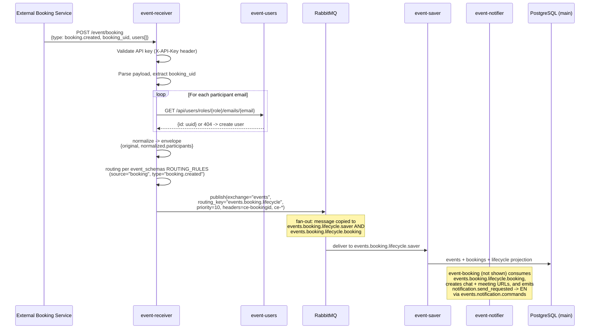

# Message Contracts

## Overview

All inter-service messages use the **CloudEvents specification v1.0** in **binary content mode**:

- **Transport:** AMQP 0.9.1 via RabbitMQ
- **Exchange:** `events` (topic, durable)
- **Routing:** Routing key = queue name; first-match glob pattern rules in event-receiver
- **Headers:** `ce-type`, `ce-source`, `ce-id`, `ce-time`, `ce-bookingid`, `ce-specversion`, `ce-idempotencykey`, `ce-traceid`, `ce-spanid`, `ce-dataschema`
- **Trace propagation:** W3C `traceparent` (and optionally `tracestate`) is injected by the OpenTelemetry instrumentation on every outbound HTTP call and every RabbitMQ publish, and extracted on every inbound HTTP request and RabbitMQ consume. It travels **alongside** the `ce-*` headers — on HTTP requests as a standard HTTP header, on AMQP messages as an additional message header. `ce-traceid`/`ce-spanid` are derived from the W3C trace/span id of the active span whenever one exists.
- **Body:** JSON event payload wrapped in `{"original": {...}, "normalized": {"participants": [...]}}`

The `original` key contains the raw source payload unchanged. The `normalized` key contains enriched participant data (with `user_id` UUIDs resolved from event-users). All consumers MUST read source-specific fields from `original`, not from the top-level body.

**Source:** `event-receiver/event_receiver/adapters/publisher.py:89-93`, `event-receiver/event_receiver/normalizers.py:53`

Priority is set via AMQP `priority` property (0-10 scale) using the `EVENT_PRIORITIES` map from event-schemas (`event-schemas/event_schemas/types.py:87-116`).

**Source:** `event-receiver/event_receiver/adapters/publisher.py:67-71`, `event-saver/event_saver/adapters/consumer.py:51-68`

---

## Exchange and Queue Registry

Reformatted from `docs/audit/CONTRACT_MAP.md`.

### Exchanges

| Exchange | Type | Durable | Declared by | Purpose |
|----------|------|---------|-------------|---------|
| `events` | topic | yes | every service (idempotent; full topology by event-receiver) | Primary message exchange for all CloudEvents |
| `events.dlx` | topic | yes | event-receiver AND every consumer (idempotent) | Dead-letter exchange for failed messages |

### Queues (canonical, from `event_schemas.queues.ALL_QUEUES`)

**Single source of truth:** `event-schemas/event_schemas/queues.py`. One queue per consumer
service; fan-out is achieved by binding several queues to the same routing key. Canonical
arguments for every queue (verbatim): `x-max-priority=10`, `x-dead-letter-exchange=events.dlx`,
`x-dead-letter-routing-key=<queue>.dlq`. Every queue has a `<queue>.dlq` companion
(`x-message-ttl=86400000`) bound to `events.dlx`. Consumers declare their own queues + DLQs at
startup; event-receiver declares the full topology.

| Queue | Binding (routing key) | Consumer | Purpose |
|-------|----------------------|----------|---------|
| `events.booking.lifecycle.saver` | `events.booking.lifecycle` | event-saver | Persist booking lifecycle events |
| `events.booking.lifecycle.booking` | `events.booking.lifecycle` | event-booking | Orchestrate chat/meeting/notifications |
| `events.chat.lifecycle` | `events.chat.lifecycle` | event-saver | Chat created/deleted |
| `events.chat.activity` | `events.chat.activity` | event-saver | Chat messages |
| `events.chat` | `events.chat` | event-saver | GetStream webhook events |
| `events.meeting.lifecycle` | `events.meeting.lifecycle` | event-saver | Meeting URL created/deleted |
| `events.notification.commands` | `events.notification.commands` | event-notifier | notification.send_requested commands |
| `events.notification.delivery` | `events.notification.delivery` | event-saver | Delivery result events |
| `events.jitsi` | `events.jitsi` | event-saver | Jitsi meeting events |
| `events.mail` | `events.mail` | event-saver | UniSender status callbacks |
| `events.user.email` | `events.user.email` | event-users | Email change requests (`user.email.change_requested`); `user.upserted` user-sync (reused queue) |
| `events.user.email.booking` | `events.user.email` | event-booking | Fan-out of `user.email.change_requested` — updates `Attendee.email` in cal.com when `booking_uid` is present |
| `events.user.synced` | `events.user.synced` | event-saver | `user.synced` → backfill `bookings.{organizer,client}_user_id` by email |
| `events.unrouted` | `events.unrouted` | event-saver | Unmatched / unknown-type events |

**Removed (audit-v2):** `events.booking.reminder` (no producer, no consumer — reminders go via
`notification.send_requested` with `trigger_event=BOOKING_REMINDER`); `events.notifications`
(legacy phantom queue).

### Canonical data envelope (audit-v2)

Every CloudEvent published by event-receiver carries `data` as
`{"original": <domain payload>, "normalized": {"participants": [{email, role, time_zone, locale, user_id}]}}`.
Typed accessors: `event_schemas.envelope.EventEnvelope` / `unwrap_payload()`. Consumers MUST NOT
read domain fields at the top level. `normalized.participants[].user_id` is the event-users UUID
resolved by the receiver. `locale` (optional, event-schemas ≥0.3.0) is the participant's preferred
language tag (e.g. `"ru"`, `"en"`): the receiver fills it from cal.com `language.locale`
(organizer/attendees) and from producer `recipients[].locale` / `users[].locale`; event-notifier
uses it for per-recipient template language selection with a configured default-locale fallback
(`ru`). Absent locale ⇒ default locale.

### Canonical CloudEvent attributes (audit-v2)

Extension attribute names come from `event_schemas.attributes`: booking identifier is
**`bookingid`** (`ce-bookingid` header) — never `booking_id`/`ce-booking_id`. Also `traceid`,
`spanid`, `idempotencykey`. Unknown event types are published to `events.unrouted` (never a 500).

Payload contracts per type: `event_schemas.mapping.PAYLOAD_MODELS` and
`docs/audit/v2/CONTRACT_DECISIONS.md`.

## Complete Message Type Registry

| CloudEvent `type` | Producer | Consumer | Routing Key (actual) | Priority | Payload Schema |
|-------------------|----------|----------|---------------------|----------|----------------|
| `booking.created` | cal.com / event-receiver (`/event/calcom`); **also event-scheduling (`/event/booking`, slice 4a, additive)**¹ | event-saver, event-booking | `events.booking.lifecycle` | 10 (CRITICAL) | `BookingCreatedPayload` |
| `booking.rescheduled` | cal.com / event-receiver; **also event-scheduling (`/event/booking`, slice 4a, additive)**¹ | event-saver, event-booking | `events.booking.lifecycle` | 10 (CRITICAL) | `BookingRescheduledPayload` |
| `booking.reassigned` | event-receiver | event-saver, event-booking | `events.booking.lifecycle` | 10 (CRITICAL) | `BookingReassignedPayload` |
| `booking.cancelled` | cal.com / event-receiver; **also event-scheduling (`/event/booking`, slice 4a, additive)**¹ | event-saver, event-booking | `events.booking.lifecycle` | 10 (CRITICAL) | `BookingCancelledPayload` |
| `booking.reminder_sent` | (no producer today; kept for saver routing) | event-saver, event-booking | `events.booking.lifecycle` | 7 (HIGH) | `BookingReminderSentPayload` |
| `booking.rejected` | event-booking (via event-receiver) | event-saver, event-booking | `events.booking.lifecycle` | 10 (CRITICAL) | `BookingRejectedPayload` |
| `chat.created` | event-booking (via event-receiver) | event-saver | `events.chat.lifecycle` | 5 (NORMAL) | `ChatCreatedPayload` |
| `chat.deleted` | event-booking (via event-receiver) | event-saver | `events.chat.lifecycle` | 5 (NORMAL) | `ChatDeletedPayload` |
| `chat.message_sent` | event-receiver | event-saver | `events.chat.activity` | 5 (NORMAL) | `ChatMessageSentPayload` |
| `meeting.url_created` | event-booking (via event-receiver) | event-saver | `events.meeting.lifecycle` | 5 (NORMAL) | `MeetingUrlCreatedPayload` |
| `meeting.url_deleted` | event-booking (via event-receiver) | event-saver | `events.meeting.lifecycle` | 5 (NORMAL) | `MeetingUrlDeletedPayload` |
| `notification.send_requested` | event-booking (via event-receiver) | event-notifier | `events.notification.commands` | 7 (HIGH) | `NotificationCommandPayload` |
| `notification.email.message_sent` | event-notifier (via event-receiver) | event-saver | `events.notification.delivery` | 7 (HIGH) | `EmailNotificationPayload` |
| `notification.telegram.message_sent` | event-notifier (via event-receiver) | event-saver | `events.notification.delivery` | 7 (HIGH) | `TelegramNotificationPayload` |
| `notification.push.message_sent` | event-notifier (push channel pending FCM credentials) | event-saver | `events.notification.delivery` | 5 (NORMAL) | `PushNotificationPayload` |
| `unisender.events.v1.transactional.status.create` | event-receiver | event-saver | `events.mail` | 5 (NORMAL) | `UniSenderStatusPayload` |
| `getstream.channel.created` | event-receiver | event-saver | `events.chat` | 5 (NORMAL) | `GetStreamEventPayload` |
| `getstream.channel.deleted` | event-receiver | event-saver | `events.chat` | 5 (NORMAL) | `GetStreamEventPayload` |
| `getstream.message.new` | event-receiver | event-saver | `events.chat` | 5 (NORMAL) | `GetStreamEventPayload` |
| `getstream.message.updated` | event-receiver | none | `events.chat` | 5 (NORMAL) | `GetStreamEventPayload` |
| `getstream.message.deleted` | event-receiver | none | `events.chat` | 5 (NORMAL) | `GetStreamEventPayload` |
| `getstream.message.read` | event-receiver | event-saver | `events.chat` | 5 (NORMAL) | `GetStreamEventPayload` |
| `jitsi.conference.joined` | jitsi-chat (via event-receiver) | event-saver | `events.jitsi` | 5 (NORMAL) | `JitsiEventPayload` |
| `jitsi.conference.left` | jitsi-chat (via event-receiver) | event-saver | `events.jitsi` | 5 (NORMAL) | `JitsiEventPayload` |
| `jitsi.participant.joined` | jitsi-chat (via event-receiver) | event-saver | `events.jitsi` | 5 (NORMAL) | `JitsiEventPayload` |
| `jitsi.participant.left` | jitsi-chat (via event-receiver) | event-saver | `events.jitsi` | 5 (NORMAL) | `JitsiEventPayload` |
| `jitsi.participant.muted` | jitsi-chat (via event-receiver) | event-saver | `events.jitsi` | 5 (NORMAL) | `JitsiEventPayload` |
| `jitsi.participant.menu_button_click` | jitsi-chat (via event-receiver) | event-saver | `events.jitsi` | 5 (NORMAL) | `JitsiEventPayload` |
| `jitsi.audio.mute_status_changed` | jitsi-chat (via event-receiver) | event-saver | `events.jitsi` | 5 (NORMAL) | `JitsiEventPayload` |
| `jitsi.video.mute_status_changed` | jitsi-chat (via event-receiver) | event-saver | `events.jitsi` | 5 (NORMAL) | `JitsiEventPayload` |
| `jitsi.speaker.dominant_changed` | jitsi-chat (via event-receiver) | event-saver | `events.jitsi` | 5 (NORMAL) | `JitsiEventPayload` |
| `jitsi.device.list_changed` | jitsi-chat (via event-receiver) | event-saver | `events.jitsi` | 5 (NORMAL) | `JitsiEventPayload` |
| `jitsi.camera.error` | jitsi-chat (via event-receiver) | event-saver | `events.jitsi` | 5 (NORMAL) | `JitsiEventPayload` |
| `jitsi.mic.error` | jitsi-chat (via event-receiver) | event-saver | `events.jitsi` | 5 (NORMAL) | `JitsiEventPayload` |
| `jitsi.error.occurred` | jitsi-chat (via event-receiver) | event-saver | `events.jitsi` | 5 (NORMAL) | `JitsiEventPayload` |
| `jitsi.peer_connection.failure` | jitsi-chat (via event-receiver) | event-saver | `events.jitsi` | 5 (NORMAL) | `JitsiEventPayload` |
| `jitsi.suspend.detected` | jitsi-chat (via event-receiver) | event-saver | `events.jitsi` | 5 (NORMAL) | `JitsiEventPayload` |
| `jitsi.toolbar.button_clicked` | jitsi-chat (via event-receiver) | event-saver | `events.jitsi` | 5 (NORMAL) | `JitsiEventPayload` |
| `user.email.change_requested` | event-admin (via event-receiver `/event/admin`) | event-users, event-booking (fan-out) | `events.user.email` | 10 (CRITICAL) | `UserEmailChangeRequestedPayload` |
| `user.upserted` | event-db-sync (**direct to RabbitMQ**) | event-users | `events.user.email` | 10 (CRITICAL) | `UserUpsertedPayload` |
| `user.synced` | event-users (**direct to RabbitMQ**) | event-saver | `events.user.synced` | 10 (CRITICAL) | `UserSyncedPayload` |
| `booking.client_reassigned` | event-admin (via event-receiver `/event/admin`) | event-saver | `events.booking.lifecycle` | 10 (CRITICAL) | `BookingClientReassignedPayload` |
| _(unmatched)_ | event-receiver | event-saver (fallback) | `events.unrouted` | -- | raw payload |

Routing keys come from `event_schemas.queues.ROUTING_RULES`; `events.booking.lifecycle` fans out to BOTH `events.booking.lifecycle.saver` and `events.booking.lifecycle.booking`; `events.user.email` fans out to BOTH `events.user.email` (event-users) and `events.user.email.booking` (event-booking).

¹ **event-scheduling as an additive `booking.lifecycle` producer (slice 4a).** A
transactional `outbox` table + background dispatcher (`event-scheduling/event_scheduling/publishing/`)
publishes `booking.created`/`booking.rescheduled`/`booking.cancelled` CloudEvents
via the **same generic `POST /event/booking` contract and endpoint** cal.com-external
booking flows already use — same headers (`ce-*`, raw `BOOKING_API_KEY` in
`Authorization`, not `Bearer`), same event types, same `events.booking.lifecycle`
routing key and fan-out. It does **not** touch `/event/calcom`, the cal.com webhook
signature path, or any other existing producer — cal.com and event-scheduling are
two independent producers feeding the same queue/routing key. **Routing fans this
out to both `events.booking.lifecycle.saver` and `events.booking.lifecycle.booking`,
and as of slice 4a.2 event-booking now reacts to event-scheduling bookings too.**
event-booking's booking lookup is a **composite adapter** (`adapters/composite_db.py`):
it reads the cal.com DB first and, when a `booking_uid` isn't there, falls back to
`GET /api/v1/bookings/{uid}/detail` on event-scheduling (Bearer `SCHEDULING_API_KEY`;
the DTO is tagged `source="scheduling"`). For a scheduling-source booking event-booking
creates the GetStream chat, mints per-participant Jitsi meeting URLs, and emits
`notification.send_requested` — the same follow-ups as a cal.com booking — while
**skipping the blacklist/constraints/reject sub-flow** (those apply to cal.com bookings
only; scheduling bookings are pre-validated upstream). **Reminders remain cal.com-only**
(the reminder scheduler still polls the cal.com DB) — deferred to slice 4a.3.
event-saver's projections continue to cover both producers.
See `event-scheduling/CLAUDE.md` and `event-scheduling/docs/SERVICE_OVERVIEW.md`.

**Source:** `event-schemas/event_schemas/queues.py`, `event-schemas/event_schemas/types.py`

---

## Event Detail: `user.email.change_requested`

Событие запроса смены email клиента, инициируемое администратором через `event-admin`.

| Атрибут | Значение |
|---------|----------|
| `ce-type` | `user.email.change_requested` |
| `ce-source` | `admin` |
| Routing key | `events.user.email` |
| Queues (fan-out) | `events.user.email` (event-users), `events.user.email.booking` (event-booking) |
| Priority | 10 (CRITICAL) |
| Producer | event-admin (через `POST /event/admin` в event-receiver) |
| Consumers | event-users, event-booking (fan-out на один routing key) |

**Payload schema (`UserEmailChangeRequestedPayload`)**:

```json
{
  "user_id": "uuid",
  "old_email": "old@example.com",
  "new_email": "new@example.com",
  "requested_by": "admin@example.com",
  "booking_uid": "book-123"
}
```

Поле `booking_uid` — **опциональное** (`str | null`). event-receiver прозрачно пробрасывает его в data; event-users игнорирует.

**Fan-out**: routing key `events.user.email` привязан к двум очередям. RabbitMQ доставляет копию сообщения каждому консьюмеру независимо.

**Flow**:
1. Admin вызывает `POST /api/users/id/{user_id}/change-email` в event-admin.
2. event-admin публикует CloudEvent в event-receiver `POST /event/admin` (auth: `Authorization: Bearer <static API key>`).
3. event-receiver маршрутизирует `admin` / `user.email.*` → routing key `events.user.email`; изменений в event-receiver нет.
4. **event-users** потребляет из `events.user.email`: обновляет `users.email`, создаёт запись в `user_email_changelog`, устанавливает `email_source='admin'`. `booking_uid` игнорируется.
5. **event-booking** потребляет из `events.user.email.booking`: если `booking_uid` задан — ищет `Booking` по uid → id, обновляет `Attendee.email` по совпадению `lower(old_email)` в одной транзакции с `SET LOCAL app.sync_suppress='on'` (подавляет триггер `event-db-sync`, чтобы избежать зацикливания синхронизации). Если `booking_uid` отсутствует — событие игнорируется.
6. Webhook outbox (event-users) доставляет изменение email в CRM; после успешной доставки сбрасывает `email_source='crm'`.

**CRM sync protection**: поле `email_source='admin'` блокирует перезапись email при следующей синхронизации с CRM до тех пор, пока outbox не доставит изменение.

**Trigger suppression**: `SET LOCAL app.sync_suppress='on'` в транзакции event-booking не позволяет триггеру `event-db-sync` (на таблице `Attendee`) переопубликовать `user.upserted` обратно в RabbitMQ. Функция триггера проверяет GUC `app.sync_suppress` перед вызовом `pg_notify`.

---

## Event Detail: `user.upserted`

Trigger-driven user-sync event emitted by `event-db-sync` when a cal.com `"Attendee"` or
`"users"` row is inserted/updated. **Published directly to RabbitMQ** — it does NOT pass
through event-receiver.

| Attribute | Value |
|-----------|-------|
| `ce-type` | `user.upserted` |
| `ce-source` | `db-sync` |
| `ce-id` | deterministic (derived from `{table, id}` + row revision) for idempotent re-emit |
| Routing key / Queue | `events.user.email` (**reuses** the existing event-users queue) |
| Priority | 10 (CRITICAL) |
| Producer | event-db-sync (direct RabbitMQ publish) |
| Consumer | event-users (`upsert_user_from_crm`) |

**Payload schema (`UserUpsertedPayload`)** — wrapped in the canonical envelope; `normalized.participants` is `[]` (db-sync emits no participant resolution):

```json
{
  "original": {
    "email": "person@example.com",
    "role": "client | organizer",
    "time_zone": "Europe/Moscow",
    "name": "Jane Doe",
    "contacts": [ { "channel": "...", "value": "..." } ]
  },
  "normalized": { "participants": [] }
}
```

**Role mapping**: cal.com `"Attendee"` → `role=client`; cal.com `"users"` → `role=organizer`.

**Flow**:
1. event-db-sync applies (idempotently, gated by `APPLY_TRIGGERS`) an additive `AFTER INSERT/UPDATE` trigger on cal.com `"Attendee"`/`"users"` that fires `pg_notify('user_sync', {"table","id"})`.
2. On NOTIFY it re-SELECTs the row, maps role, and publishes `user.upserted` directly to RabbitMQ on `events.user.email`.
3. A **watermark reconcile sweep** (own `sync_state` Postgres DB) re-emits rows missed during downtime and serves as the one-time cutover backfill; `POST /admin/full-sync` (bearer `SYNC_ADMIN_TOKEN`, `?source=attendee|users|all`) forces a full pass with cal.com as source of truth.
4. event-users consumes it from `events.user.email`, upserts the user (`ON CONFLICT (email, role)`, updates `time_zone`), then emits `user.synced`.

---

## Event Detail: `user.synced`

Emitted by `event-users` after it upserts a user from a `user.upserted` event, carrying the
resolved `user_id`. **Published directly to RabbitMQ** — it does NOT pass through event-receiver.

| Attribute | Value |
|-----------|-------|
| `ce-type` | `user.synced` |
| `ce-source` | `event-users` |
| `ce-id` | deterministic (derived from `user_id` + email/role) for idempotent backfill |
| Routing key / Queue | `events.user.synced` (new, saver-owned) |
| Priority | 10 (CRITICAL) |
| Producer | event-users (direct RabbitMQ publish) |
| Consumer | event-saver (email backfill) |

**Payload schema (`UserSyncedPayload`)** — canonical envelope; `normalized.participants` may be `[]`:

```json
{
  "original": {
    "email": "person@example.com",
    "role": "client | organizer",
    "user_id": "uuid",
    "time_zone": "Europe/Moscow"
  }
}
```

**Flow**:
1. event-users upserts the user from `user.upserted` (`upsert_user_from_crm`) and publishes `user.synced` directly to RabbitMQ on `events.user.synced`.
2. event-saver consumes it from `events.user.synced` and backfills `bookings.organizer_user_id` / `bookings.client_user_id` by matching the participant email (joined through `events.payload->'normalized'->'participants'`), NULL-guarded and idempotent.
3. The existing HTTP-poll `UserIdBackfillService` remains as a slow safety net.

---

## Event Detail: `booking.client_reassigned`

Событие смены клиента в бронировании, инициируемое администратором через `event-admin`.

| Атрибут | Значение |
|---------|----------|
| `ce-type` | `booking.client_reassigned` |
| `ce-source` | `admin` |
| Queue | `events.booking.lifecycle` |
| Priority | 10 (CRITICAL) |
| Producer | event-admin (через `POST /event/admin` в event-receiver) |
| Consumer | event-saver (`LifecycleProjection`, маппинг `BOOKING_CLIENT_REASSIGNED`) |

**Payload schema (`BookingClientReassignedPayload`,** `event-schemas/event_schemas/user.py`**)**:

```json
{
  "booking_uid": "book-123",
  "new_client_user_id": "uuid",
  "requested_by": "admin@example.com"
}
```

**Flow**:
1. Admin вызывает `POST /bookings/{booking_uid}/reassign-client` в event-admin.
2. event-admin проверяет, что booking существует (404 иначе) и что в event-users есть client с указанным email (lowercase, 404 иначе).
3. event-admin публикует CloudEvent в event-receiver `POST /event/admin` (auth: `Authorization: Bearer <static API key>`; ошибка публикации → 502, действие не применено).
4. event-receiver маршрутизирует `admin` / `booking.client_reassigned` → `events.booking.lifecycle`.
5. event-saver проецирует смену клиента в `bookings.client_user_id` и lifecycle-историю.

---

## Event Detail: `booking.rejected`

Событие отказа в бронировании, инициируемое service event-booking при нарушении constraint (когда enabled) или при совпадении клиента с записью чёрного списка (`rejection_type='blacklisted'`).

| Атрибут | Значение |
|---------|----------|
| `ce-type` | `booking.rejected` |
| `ce-source` | `booking` |
| Queue | `events.booking.lifecycle` |
| Priority | 10 (CRITICAL) |
| Producer | event-booking (через `POST /event/cloudevents` в event-receiver) |
| Consumers | event-saver (audit), event-notifier (notifications) |

**Payload schema (`BookingRejectedPayload`)**:

```json
{
  "booking_uid": "uuid",
  "client_email": "client@example.com",
  "rejection_type": "blacklisted | month_limit | year_limit | min_interval | null",
  "rejection_reasons": ["string", ...]
}
```

**Flow**:
1. event-booking consumes `booking.created` from `events.booking.lifecycle`.
2. Blacklist check first (active set from event-admin `GET /api/blacklist/active`, static `BLACKLIST_SERVICE_TOKEN`, in-memory TTL cache, fail-open). Match → `rejection_type='blacklisted'`. Otherwise constraint analyzer determines violation (if `IS_ENABLE_BOOKING_CONSTRAINTS=true`).
3. event-booking publishes CloudEvent to event-receiver `POST /event/cloudevents` (auth: Bearer token).
4. event-receiver маршрутизирует `booking` / `booking.rejected` → `events.booking.lifecycle`.
5. event-saver потребляет и сохраняет в audit table; event-notifier отправляет rejection notification client.

**Intended flow**: This event integrates with event-notifier's routing rules to notify the client that their booking was rejected due to constraints or the blacklist.

**Notification trigger**: alongside `booking.rejected` event-booking publishes `notification.send_requested`; constraint rejections use `trigger_event=BOOKING_REJECTED`, blacklist rejections use the dedicated `trigger_event=BOOKING_REJECTED_BLACKLISTED` (separate neutral templates — client-facing text never mentions the blacklist).

---

## End-to-End Flow: Booking Created



This flow was verified live in audit-v2 with a real cal.com payload (`docs/audit/v2/INTEGRATION_REPORT.md` §3).

**As of slice 4a, `event-scheduling` is a concrete instance of "External Booking
Service" above** — its background outbox dispatcher plays exactly this role
(`ReceiverClient`/`UsersClient` in `event-scheduling/event_scheduling/publishing/`),
except email resolution is `POST /api/users/by-ids` (batch) rather than the
per-participant `GET /api/users/roles/{role}/emails/{email}` loop shown, and auth
is a raw shared secret rather than `X-API-Key`. The rest of the flow — routing,
fan-out, event-saver projection — is identical and shared with cal.com's flow. As of
slice 4a.2 event-booking (the `EN`/chat/meeting box) also acts on events sourced this
way: its composite adapter pulls `GET /api/v1/bookings/{uid}/detail` from event-scheduling
when the uid isn't in cal.com, then provisions chat/Jitsi/notifications (reminders stay
cal.com-only, deferred to 4a.3). See footnote ¹ above.

---

## End-to-End Flow: Notification Send

```mermaid
sequenceDiagram
    participant Src as Any Source
    participant ER as event-receiver
    participant RMQ as RabbitMQ
    participant EN as event-notifier
    participant DB_N as PostgreSQL (notifier)
    participant EU as event-users
    participant Email as UniSender Go API
    participant TG as Telegram Bot API

    Src->>ER: POST /event/booking<br/>{type: notification.send_requested,<br/>recipients[{email, role, locale?}], template_data}
    ER->>ER: API-key auth, normalize recipients -><br/>normalized.participants (+user_id)
    ER->>ER: routing rules -><br/>"events.notification.commands"
    ER->>RMQ: publish(routing_key=<br/>"events.notification.commands")

    Note over EN: event-notifier subscribes to<br/>"events.notification.commands" by default<br/>(queue mismatch C-3 resolved).

    RMQ->>EN: deliver message

    EN->>EN: unwrap envelope, validate<br/>NotificationCommandPayload
    EN->>EN: trigger_event from payload;<br/>user_id per recipient from<br/>normalized.participants (by email)
    EN->>DB_N: atomic processed_events claim<br/>+ outbox insert (idempotent)

    loop Per recipient
        EN->>EU: GET /api/users/id/{user_id}
        EU-->>EN: ChannelContact[]
    end

    EN->>DB_N: write_outbox_atomically()<br/>(outbox records + mark processed)

    loop OutboxSender polls every 1s
        EN->>DB_N: SELECT ... FOR UPDATE SKIP LOCKED<br/>(inside transaction)
        EN->>Email: POST /email/send.json<br/>(template_id from _TEMPLATE_MAP)
        Email-->>EN: 200 OK
        EN->>TG: POST /bot{token}/sendMessage<br/>(hardcoded Russian text)
        TG-->>EN: 200 OK
        EN->>DB_N: UPDATE status='delivered'
    end

    EN->>ER: POST notification.*.message_sent<br/>(delivery result, fire-and-forget)
    Note over ER: result routed to<br/>events.notification.delivery<br/>and persisted by event-saver
```

**Source:** `event-notifier/docs/SERVICE_OVERVIEW.md`, `docs/audit/v2/CONTRACT_DECISIONS.md` D6

---

## Schema Versioning

### How It Works (In Theory)

1. `event-schemas/event_schemas/types.py:119-145` defines `EVENT_SCHEMA_VERSIONS`: a dict mapping every `EventType` to a semver string.
2. event-receiver's `CloudEventPublisher` embeds this version in the `dataschema` CloudEvent attribute as a URI (e.g., `urn:events:booking.created:v1`).
3. Intended semantics: major bump = breaking payload change, minor bump = additive change.

### How It Actually Works

All 25 event types are version `"v1"`. No consumer reads or validates the `dataschema` attribute. Version bumps have no operational effect on routing, parsing, or validation. There is no schema registry, no backward-compatibility enforcement, and no automated validation that a payload matches its declared schema.

**Source:** `event-schemas/docs/SERVICE_OVERVIEW.md:57-78`

---

## Known Inconsistencies

### IC-1: Booking lifecycle events routed to wrong queue [RESOLVED]

First-match routing in `event-receiver/event_receiver/config.py:9-34` sends `booking.created`, `booking.cancelled`, `booking.rescheduled`, `booking.reassigned`, `booking.reminder_sent` to `events.notifications` instead of `events.booking.lifecycle`.

### IC-2: event-notifier queue mismatch [RESOLVED]

`event-notifier/event_notifier/config.py:18` now correctly defaults to `events.notification.commands`, which matches the routing key event-receiver uses for `notification.send_requested` events. The previous default of `events.notifications` caused messages to pile up unconsumed.

### IC-3: Dual EventType enums [RESOLVED]

`event-schemas` defines `EventType.BOOKING_CREATED = "booking.created"` while `event-saver` defines `EventType.BOOKING_CREATED = "booking.events.v1.booking.created.create"` (`event-saver/event_saver/event_types.py:29`). The shared library is not used by its largest consumer.

Resolved in audit-v2: event-saver's parallel enum and routing config were deleted; it consumes `event_schemas` types and `SAVER_QUEUES` directly.

### IC-4: Queue declaration argument mismatch [RESOLVED — audit-v2]

Resolved by audit-v2 contracts fix: all services declare queues from `event_schemas.queues.QueueSpec` with identical arguments, and event-saver/event-booking/event-notifier declare `events.dlx` and their own DLQs idempotently.

### IC-5: Missing delivery result pipeline [RESOLVED — audit-v2]

event-notifier now publishes `notification.*.message_sent` binary CloudEvents to event-receiver after successful delivery (`DeliveryResultPublisher`, fire-and-forget, active when `EVENTS_ENDPOINT_URL` is set); event-saver persists them from `events.notification.delivery`.

### IC-6: Orphaned queues [RESOLVED — audit-v2]

| Queue | Why Orphaned |
|-------|-------------|
| `events.booking.lifecycle` | Routing never sends messages here (IC-1) |
| `events.booking.reminder` | Same routing bug (IC-1) |
| `events.notification.commands` | Previously orphaned (IC-2, resolved); event-notifier now consumes this queue by default |

**Full details:** `docs/audit/CONTRACT_MAP.md:139-207`

---

## How to Add a New Message Type

### Step 1: Define the Schema

Add a Pydantic model in the appropriate module under `event-schemas/event_schemas/`:
- Booking events: `booking.py`
- Chat events: `chat.py`
- Notification events: `notification.py`
- External integrations: `external.py`

Export from `__init__.py` via `__all__`.

### Step 2: Register the EventType

In `event-schemas/event_schemas/types.py`:
1. Add a member to `class EventType(StrEnum)` with the CloudEvent type string value
2. Add an entry to `EVENT_PRIORITIES` dict (choose CRITICAL=10, HIGH=7, NORMAL=5, or LOW=1)
3. Add an entry to `EVENT_SCHEMA_VERSIONS` dict (start at `"v1"`)

### Step 3: Add Routing Rule

In `event-schemas/event_schemas/queues.py`, add a `RoutingRuleSpec` to `ROUTING_RULES`
(glob on source/type). event-receiver generates its routing from this table.
Also add the type to `PAYLOAD_MODELS` in `event_schemas/mapping.py`.

**Important:** Rule position matters. First match wins. Place specific rules before broad globs.

### Step 4: Add Normalizer (if event-receiver validates payload)

In `event-receiver/event_receiver/normalizers.py`, add a normalization path that extracts participants and produces a `NormalizedPayload`.

### Step 5: Add Consumer Handling (event-saver)

1. event-saver consumes `SAVER_QUEUES` from event-schemas — no per-service enum or routing config to touch
2. If new projection needed: create handler in `event-saver/event_saver/infrastructure/persistence/projections/`, register in `ioc.py`

### Step 6: Declare Queue (if new)

If the target queue is new, add a `QueueSpec` to `event-schemas/event_schemas/queues.py`
(`ALL_QUEUES`) and assign exactly ONE consumer service. Consumers declare their own queues
and DLQs from the spec at startup; event-receiver declares the full topology.

### Step 7: Update Documentation

- `event-receiver/QUEUES_DIGEST.md`
- `event-saver/QUEUES_DIGEST.md`
- `event-receiver/EVENTS_DIGEST.md`
- This file (MESSAGE_CONTRACTS.md)
