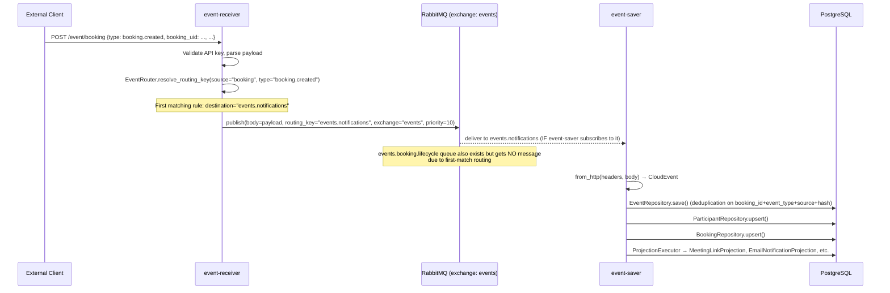
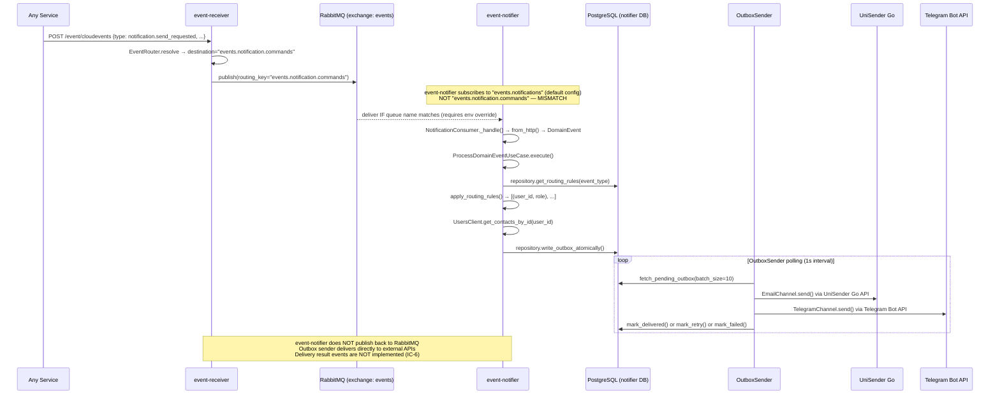

# Message Contract Map

Generated: 2026-04-20

---

## Exchange Registry

| Exchange | Type | Durable | Declared by | Services using it |
|---|---|---|---|---|
| `events` | topic | yes | event-receiver (`RabbitTopologyManager.ensure_topology`), event-saver (`RabbitTopologyManager.ensure_topology`) | event-receiver (publisher), event-saver (consumer + publisher), event-notifier (consumer) |
| `events.dlx` | topic | yes | event-receiver (`RabbitTopologyManager.ensure_topology`) | event-receiver only -- DLX for failed messages; no service consumes DLQ queues |

**Notes:**
- event-saver's `ensure_topology` declares the `events` exchange and plain durable queues but does **not** create the DLX exchange or DLQ queues.
- event-notifier declares the exchange object in its IoC (`RabbitExchange(name=..., type=TOPIC, durable=True)`) but does **not** call `ensure_topology`; it subscribes with `declare=False`, expecting the queue to already exist.

---

## Queue Registry

All main queues bind with routing key = queue name on the `events` exchange.

| Queue | Durable | x-max-priority | DLQ configured? | Declared by | Binding key | Consumer service |
|---|---|---|---|---|---|---|
| `events.booking.lifecycle` | yes | 10 (receiver) / none (saver) | yes (receiver) / no (saver) | event-receiver, event-saver | `events.booking.lifecycle` | event-saver |
| `events.booking.reminder` | yes | 10 / none | yes / no | event-receiver, event-saver | `events.booking.reminder` | event-saver |
| `events.chat.lifecycle` | yes | 10 / none | yes / no | event-receiver, event-saver | `events.chat.lifecycle` | event-saver |
| `events.chat.activity` | yes | 10 / none | yes / no | event-receiver, event-saver | `events.chat.activity` | event-saver |
| `events.meeting.lifecycle` | yes | 10 / none | yes / no | event-receiver, event-saver | `events.meeting.lifecycle` | event-saver |
| `events.notification.delivery` | yes | 10 / none | yes / no | event-receiver, event-saver | `events.notification.delivery` | event-saver |
| `events.notification.commands` | yes | 10 / none | yes / no | event-receiver, event-saver | `events.notification.commands` | **event-notifier** (intended but misconfigured -- see IC-2) |
| `events.notifications` | yes | 10 / none | yes / no | event-receiver | `events.notifications` | **event-notifier** (actual default config); event-saver does NOT subscribe unless explicitly configured |
| `events.jitsi` | yes | 10 / none | yes / no | event-receiver, event-saver | `events.jitsi` | event-saver |
| `events.mail` | yes | 10 / none | yes / no | event-receiver, event-saver | `events.mail` | event-saver |
| `events.chat` | yes | 10 / none | yes / no | event-receiver, event-saver | `events.chat` | event-saver |
| `events.unrouted` | yes | 10 / none | yes / no | event-receiver, event-saver | `events.unrouted` | event-saver (fallback) |
| `events.booking.lifecycle.dlq` | yes | -- | -- | event-receiver | `events.booking.lifecycle.dlq` (on `events.dlx`) | none (dead-letter storage) |
| `events.notification.commands.dlq` | yes | -- | -- | event-receiver | `events.notification.commands.dlq` (on `events.dlx`) | none (dead-letter storage) |
| _(all other `*.dlq` variants)_ | yes | -- | -- | event-receiver | `<queue>.dlq` (on `events.dlx`) | none (dead-letter storage, 24h TTL) |

---

## Message Type Registry

| CloudEvent `type` | Producer | Consumer | Exchange | Routing key | Priority | Schema version | Payload schema |
|---|---|---|---|---|---|---|---|
| `booking.created` | event-receiver | event-saver (if subscribed), event-notifier | `events` | `events.notifications` (actual) | 10 (CRITICAL) | v1 | `BookingCreatedPayload` |
| `booking.rescheduled` | event-receiver | event-saver (if subscribed), event-notifier | `events` | `events.notifications` (actual) | 10 (CRITICAL) | v1 | `BookingRescheduledPayload` |
| `booking.reassigned` | event-receiver | event-saver (if subscribed), event-notifier | `events` | `events.notifications` (actual) | 10 (CRITICAL) | v1 | `BookingReassignedPayload` |
| `booking.cancelled` | event-receiver | event-saver (if subscribed), event-notifier | `events` | `events.notifications` (actual) | 10 (CRITICAL) | v1 | `BookingCancelledPayload` |
| `booking.reminder_sent` | event-receiver | event-saver (if subscribed), event-notifier | `events` | `events.notifications` (actual) | 7 (HIGH) | v1 | `BookingReminderSentPayload` |
| `chat.created` | event-receiver | event-saver | `events` | `events.chat.lifecycle` | 5 (NORMAL) | v1 | `ChatCreatedPayload` |
| `chat.deleted` | event-receiver | event-saver | `events` | `events.chat.lifecycle` | 5 (NORMAL) | v1 | `ChatDeletedPayload` |
| `chat.message_sent` | event-receiver | event-saver | `events` | `events.chat.activity` | 5 (NORMAL) | v1 | `ChatMessageSentPayload` |
| `meeting.url_created` | event-receiver | event-saver | `events` | `events.meeting.lifecycle` | 5 (NORMAL) | v1 | `MeetingUrlCreatedPayload` |
| `meeting.url_deleted` | event-receiver | event-saver | `events` | `events.meeting.lifecycle` | 5 (NORMAL) | v1 | `MeetingUrlDeletedPayload` |
| `notification.send_requested` | event-receiver | event-notifier (intended) | `events` | `events.notification.commands` | 7 (HIGH) | v1 | `NotificationCommandPayload` |
| `notification.email.message_sent` | event-notifier (intended, NOT implemented) | event-saver | `events` | `events.notification.delivery` | 7 (HIGH) | v1 | `EmailNotificationPayload` |
| `notification.telegram.message_sent` | event-notifier (intended, NOT implemented) | event-saver | `events` | `events.notification.delivery` | 7 (HIGH) | v1 | `TelegramNotificationPayload` |
| `notification.push.message_sent` | event-notifier (intended, NOT implemented) | event-saver | `events` | `events.notification.delivery` | 5 (NORMAL) | v1 | `PushNotificationPayload` |
| `unisender.events.v1.transactional.status.create` | event-receiver | event-saver | `events` | `events.mail` | 5 (NORMAL) | v1 | `UniSenderStatusPayload` |
| `getstream.channel.created` | event-receiver | event-saver | `events` | `events.chat` | 5 (NORMAL) | v1 | `GetStreamEventPayload` |
| `getstream.channel.deleted` | event-receiver | event-saver | `events` | `events.chat` | 5 (NORMAL) | v1 | `GetStreamEventPayload` |
| `getstream.message.new` | event-receiver | event-saver | `events` | `events.chat` | 5 (NORMAL) | v1 | `GetStreamEventPayload` |
| `getstream.message.updated` | event-receiver | none | `events` | `events.chat` | 5 (NORMAL) | v1 | `GetStreamEventPayload` |
| `getstream.message.deleted` | event-receiver | none | `events` | `events.chat` | 5 (NORMAL) | v1 | `GetStreamEventPayload` |
| `getstream.message.read` | event-receiver | event-saver | `events` | `events.chat` | 5 (NORMAL) | v1 | `GetStreamEventPayload` |
| `jitsi.*` (any type) | event-receiver | event-saver | `events` | `events.jitsi` | 5 (NORMAL) | v1 | `JitsiEventPayload` |
| _(unmatched)_ | event-receiver | event-saver (fallback) | `events` | `events.unrouted` | -- | -- | raw payload |

---

## End-to-End Flow: Booking Created

---

## End-to-End Flow: Notification Send

---

## Known Contract Inconsistencies

### IC-1: First-match routing shadows `events.booking.lifecycle` [CRITICAL]

**Location:** `event-receiver/event_receiver/config.py`, `_default_route_rules()`

The routing rules list places 5 `events.notifications` destination rules **before** the `events.booking.lifecycle` rules. The router returns on first match. For events with `source="booking"` and types `booking.created`, `booking.cancelled`, `booking.rescheduled`, `booking.reassigned`, `booking.reminder_sent`, the resolved routing key is always `events.notifications` -- never `events.booking.lifecycle`.

**Impact:** `events.booking.lifecycle` receives zero messages for these 5 event types. event-saver projections for booking lifecycle are only populated if event-saver subscribes to `events.notifications`.

---

### IC-2: event-notifier consumer queue mismatch [CRITICAL]

**Location:** `event-notifier/event_notifier/config.py`, line 19

`Settings.notifications_queue` defaults to `"events.notifications"`, but CLAUDE.md and event-receiver's routing rule for `notification.send_requested` both point to `events.notification.commands`.

**Impact:** `notification.send_requested` events accumulate in `events.notification.commands` with no consumer. event-notifier processes booking lifecycle events from `events.notifications` instead -- functional but architecturally incorrect, bypassing the intended command pattern.

**Three-way inconsistency:**
1. CLAUDE.md documents queue as `events.notification.commands`
2. `config.py` defaults to `events.notifications`
3. `.env.example` also uses `events.notifications`

---

### IC-3: QUEUES_DIGEST documentation error in both services

Both `event-receiver/QUEUES_DIGEST.md` and `event-saver/QUEUES_DIGEST.md` document `events.booking.lifecycle` as the destination for booking lifecycle events. Due to IC-1, the actual runtime destination is `events.notifications`.

---

### IC-4: event-saver topology manager does not create DLQ/priority queues

event-receiver creates queues with `x-max-priority=10` and `x-dead-letter-exchange=events.dlx`. event-saver creates plain durable queues without those arguments. If event-saver starts first, a RabbitMQ declaration conflict may occur (mismatched queue arguments), causing the second service to fail queue declaration.

---

### IC-5: `events.notifications` not in event-saver's default routing config

event-saver's `_default_route_rules()` does not include `events.notifications` as a destination. Its `topology_queues` derives from routing destinations. Unless `RABBIT_TOPOLOGY_QUEUES` is explicitly set, event-saver does **not** subscribe to `events.notifications` and does not persist booking lifecycle events.

---

### IC-6: event-notifier `infrastructure/publisher.py` does not exist

CLAUDE.md references `infrastructure/publisher.py` as "publishes back via HTTP to event-receiver". This file does not exist. The `OutboxSender` delivers directly to external APIs. Delivery result events (`notification.*.message_sent`) are never published, leaving the `events.notification.delivery` queue permanently empty.

---

## Orphaned Queues and Producers

### Orphaned Queues (declared but no active consumer or no messages arriving)

| Queue | Declared by | Why orphaned |
|---|---|---|
| `events.booking.lifecycle` | event-receiver, event-saver | Routing sends lifecycle events to `events.notifications` first (IC-1); queue exists but receives zero messages |
| `events.booking.reminder` | event-receiver, event-saver | `booking.reminder_sent` routed to `events.notifications` first (IC-1) |
| `events.notification.commands` | event-receiver, event-saver | `notification.send_requested` arrives here but event-notifier does not consume it (IC-2) |
| All `*.dlq` queues | event-receiver | Dead-letter storage with no active consumer -- by design but no monitoring in place |

### Orphaned Producers (publishing to queue with no consumer)

| Producer | Queue | CloudEvent type | Status |
|---|---|---|---|
| event-receiver | `events.notification.commands` | `notification.send_requested` | No consumer -- event-notifier misconfigured (IC-2) |
| event-receiver | `events.booking.lifecycle` | `booking.created`, `booking.cancelled`, `booking.rescheduled`, `booking.reassigned` | Unreachable -- routing never reaches this queue (IC-1) |
| event-receiver | `events.booking.reminder` | `booking.reminder_sent` | Unreachable -- same reason (IC-1) |

---

## Schema Drift Matrix

| EventType (event-schemas) | Schema model defined? | Used in event-receiver? | Used in event-saver? | Notes |
|---|---|---|---|---|
| `booking.created` | BookingCreatedPayload | Validated in ingest + normalizer | Own enum (`booking.events.v1.booking.created.create`) | String mismatch |
| `booking.rescheduled` | BookingRescheduledPayload | Not validated | No enum member in event-saver | Missing from saver enum |
| `booking.reassigned` | BookingReassignedPayload | Normalizer only (broken -- CRITICAL-2) | Own enum | AttributeError at runtime |
| `booking.cancelled` | BookingCancelledPayload | Normalizer reuses created path (schema mismatch) | Own enum | Missing user/client fields |
| `booking.reminder_sent` | BookingReminderSentPayload | Normalizer only | Own enum | OK |
| `chat.created` | ChatCreatedPayload | Not used | Routed by pattern only | No validation |
| `chat.deleted` | ChatDeletedPayload | Not used | Routed by pattern only | No validation |
| `chat.message_sent` | ChatMessageSentPayload | Not used | Routed by pattern only | No validation |
| `meeting.url_created` | MeetingUrlCreatedPayload | Normalizer (generic users list) | Own enum | No model validation |
| `meeting.url_deleted` | MeetingUrlDeletedPayload | Normalizer (generic users list) | Own enum | No model validation |
| `notification.email.message_sent` | EmailNotificationPayload | Normalizer (generic users list) | Own enum | No model validation |
| `notification.telegram.message_sent` | TelegramNotificationPayload | Normalizer (generic users list) | Own enum | No model validation |
| `notification.send_requested` | NotificationCommandPayload | Routed only | Not in saver enum | Consumed by event-notifier |
| `notification.push.message_sent` | PushNotificationPayload | Not used | Not in saver enum | No consumer |
| `unisender.events.v1.transactional.status.create` | UniSenderStatusPayload | Normalizer validated | Own enum (same string) | Only matching string value |
| `getstream.channel.created` | GetStreamEventPayload (shared) | Normalizer validated | Own enum (different string) | Typo in enum name (CHANEL) |
| `getstream.channel.deleted` | GetStreamEventPayload (shared) | Normalizer validated | Own enum (different string) | Typo in enum name (CHANEL) |
| `getstream.message.new` | GetStreamEventPayload (shared) | Normalizer validated | Own enum (different string) | String mismatch |
| `getstream.message.updated` | GetStreamEventPayload (shared) | Not used in normalizer | No saver enum member | No consumer |
| `getstream.message.deleted` | GetStreamEventPayload (shared) | Not used in normalizer | No saver enum member | No consumer |
| `getstream.message.read` | GetStreamEventPayload (shared) | Not used in normalizer | Own enum (different string) | String mismatch |
| `jitsi.room.created` | JitsiEventPayload (shared) | Normalizer validated | Matched by prefix pattern | No typed enum |
| `jitsi.participant.joined` | JitsiEventPayload (shared) | Normalizer validated | Matched by prefix pattern | No typed enum |
| `jitsi.participant.left` | JitsiEventPayload (shared) | Normalizer validated | Matched by prefix pattern | No typed enum |
| -- | EmailRejectionNotificationPayload | Not wired to any EventType | Not used | **Orphaned model** |

**Legend:** "Own enum" = event-saver has its own `EventType` member with a different string value than `event-schemas`.
