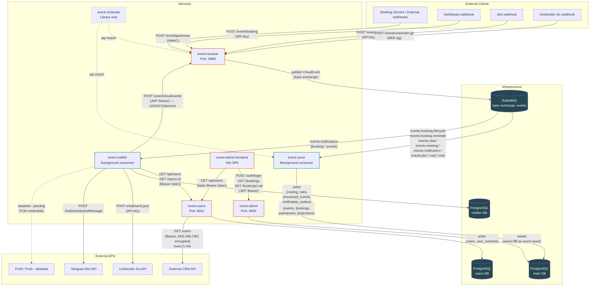

# Service Dependency Graph

Generated: 2026-04-20

## System Topology



## Synchronous Dependencies

| Caller | Callee | Endpoint | Purpose | Failure Impact |
|--------|--------|----------|---------|----------------|
| External booking service | event-receiver | `POST /event/booking` | Submit booking lifecycle / chat / meeting / notification events | Bookings not ingested; events lost if no retry on caller side |
| GetStream webhook | event-receiver | `POST /event/getstream` | GetStream chat events | Chat activity not tracked |
| Jitsi webhook | event-receiver | `POST /event/jitsi` | Jitsi meeting events | Meeting links not tracked |
| UniSender Go webhook | event-receiver | `POST /event/unisender-go` | Email delivery status callbacks | Email delivery statuses not recorded |
| event-admin-frontend | event-admin | `POST /auth/login` | Admin login, get JWT | Admin UI login fails entirely |
| event-admin-frontend | event-admin | `GET /bookings` | List bookings with filters | Booking list page unavailable |
| event-admin-frontend | event-admin | `GET /bookings/{uid}` | Booking detail view | Booking detail page unavailable |
| event-admin-frontend | event-admin | `GET /bookings/future-email-bounced` | Bounced email list | Bounced email view unavailable |
| event-admin-frontend | event-users | `GET /api/users` | List participants with filters | Participants page unavailable |
| event-admin-frontend | event-users | `GET /api/users/{id}` | Single user lookup | User detail unavailable |
| event-notifier | event-users | `GET /api/users?email=&role=` | Resolve notification contacts by email (legacy path) | Falls back to email-only channel; degraded (no Telegram) |
| event-notifier | event-users | `GET /users/{user_id}` | Resolve contacts by UUID (primary path) | No contacts resolved; notification silently skipped |
| event-notifier | event-receiver | `POST /event/cloudevents` | Publish delivery result events (legacy/planned -- not confirmed active) | Fire-and-forget; errors logged only |

## Asynchronous Dependencies

| Producer | Queue | Consumer | Event Types | Failure Impact |
|----------|-------|----------|-------------|----------------|
| event-receiver | `events.booking.lifecycle` | event-saver | `booking.created`, `booking.rescheduled`, `booking.reassigned`, `booking.cancelled` | Booking records not persisted; data loss if queue not durable |
| event-receiver | `events.booking.reminder` | event-saver | `booking.reminder_sent` | Reminder events not saved |
| event-receiver | `events.chat.lifecycle` | event-saver | `chat.created`, `chat.deleted` | Chat lifecycle not projected |
| event-receiver | `events.chat.activity` | event-saver | `chat.message_sent` | Chat activity not projected |
| event-receiver | `events.meeting.lifecycle` | event-saver | `meeting.url_created`, `meeting.url_deleted` | Meeting links not projected |
| event-receiver | `events.notification.delivery` | event-saver | `notification.email.message_sent`, `notification.telegram.message_sent` | Delivery confirmations not stored |
| event-receiver | `events.notification.commands` | (planned) | `notification.send_requested` | Notification commands queued but no consumer currently deployed |
| event-receiver | `events.jitsi` | event-saver | All `source=jitsi*` events | Jitsi events not stored |
| event-receiver | `events.mail` | event-saver | `unisender.*` from `unisender-go` source | UniSender callback data not stored |
| event-receiver | `events.chat` | event-saver | `getstream.*` from `getstream` source | GetStream webhook data not stored |
| event-receiver | `events.unrouted` | (none/dead letter) | Anything unmatched by routing rules | Events silently dropped |
| event-receiver | `events.notifications` | event-notifier | `booking.created`, `booking.cancelled`, `booking.rescheduled`, `booking.reassigned`, `booking.reminder_sent` | Notifications not dispatched; outbox not written |

> **Discrepancy**: event-notifier subscribes to `events.notifications` (per its `config.py`), but the QUEUES_DIGEST lists `events.notification.commands` for `notification.send_requested`. These are different queues. Needs verification against actual event-receiver routing config.

## External Dependencies

| Service | External System | Purpose | Failure Impact |
|---------|----------------|---------|----------------|
| event-users | External CRM API | Background sync of users (every 5 min) | Sync silently fails; existing DB data stale but retained |
| event-notifier | UniSender Go API | Transactional email delivery | Returns failure; outbox retries up to 5x with exponential backoff |
| event-notifier | Telegram Bot API | Telegram message delivery | Returns failure; outbox retries up to 5x with exponential backoff |
| event-notifier | Firebase FCM | Push notification delivery | Disabled (code commented out pending credentials) |
| event-receiver | GetStream | Inbound webhook source (HMAC-SHA256 validation) | N/A (receiver only) |
| event-receiver | Jitsi | Inbound webhook source (API key validation) | N/A (receiver only) |
| event-receiver | UniSender Go | Inbound webhook source (MD5 signature validation) | N/A (receiver only) |

## Database Ownership

| DB Name | Port | Owning Service | Reading Services | Credentials Shared? |
|---------|------|----------------|------------------|---------------------|
| `zhivaya-admin` | 5439 | event-saver | event-admin (same DSN, read-only by convention) | Yes -- both use `postgres`/`postgres`; no DB-level read-only enforcement |
| `zhivaya-users` | 5446 | event-users | event-admin-frontend, event-notifier (via HTTP API only) | No -- only event-users connects directly |
| `event_notifier` | 5432 | event-notifier | None | No -- only event-notifier connects directly |

No service directly connects to another service's database. All cross-service data access is via HTTP APIs, except for event-admin which shares the same DSN as event-saver.

## Single Points of Failure

| Component | Services That Break If It Goes Down | Severity |
|-----------|-------------------------------------|----------|
| **RabbitMQ** | event-receiver (cannot publish, 500 on ingest), event-saver (stops consuming), event-notifier (stops consuming) | CRITICAL |
| **PostgreSQL [main DB]** | event-saver (cannot write), event-admin (cannot read, all API calls fail, frontend broken) | CRITICAL |
| **event-receiver** | Booking service loses ingress endpoint; all webhook integrations fail | HIGH |
| **event-users** | Frontend participants page fails; event-notifier cannot resolve contacts (falls back to email-only) | MEDIUM |
| **PostgreSQL [users DB]** | event-users fully down; frontend participants page fails; event-notifier contact resolution fails | MEDIUM |
| **PostgreSQL [notifier DB]** | event-notifier cannot write outbox; notifications not dispatched | MEDIUM |
| **event-admin** | Frontend login and all booking views unavailable | MEDIUM |
| **UniSender Go API** | Email notifications fail for that attempt; outbox retries up to 5x | LOW |
| **Telegram Bot API** | Telegram notifications fail for that attempt; outbox retries up to 5x | LOW |
| **External CRM API** | User sync pauses; stale data in event-users DB; existing contacts still served | LOW |

**Top single points of failure: RabbitMQ and PostgreSQL [main DB].**

## Critical Path: Booking Creation

```
1. Booking service  →  POST /event/booking (event-receiver, API key auth)
2. event-receiver   →  validates payload, wraps in CloudEvent
3. event-receiver   →  publishes to RabbitMQ exchange "events", routing key "events.booking.lifecycle"
4. event-saver      →  consumes from "events.booking.lifecycle"
5. event-saver      →  IngestEventUseCase:
                         a. EventParser → ParsedEvent
                         b. EventRepository.save() [dedup by (booking_id, event_type, source, hash)]
                         c. ParticipantExtractor → ParticipantRepository.upsert()
                         d. BookingDataExtractor → BookingRepository.upsert()
                         e. ProjectionExecutor → booking_meeting_links, booking_*_notifications, etc.
6. PostgreSQL       →  persisted in: events, bookings, participants, projections tables
```

Additionally, for notification dispatch on booking creation:

```
7.  RabbitMQ         →  event-notifier consumes from "events.notifications" (booking.created)
8.  event-notifier   →  ProcessDomainEventUseCase: checks routing_rules in notifier DB
9.  event-notifier   →  GET /users/{user_id} on event-users (contact resolution)
10. event-notifier   →  writes to notification_outbox in notifier DB
11. OutboxSender     →  polls outbox → calls UniSender Go / Telegram Bot API
```

## Minimum Viable Subset

The minimum services required to receive a booking event and persist it:

1. **event-receiver** -- HTTP ingress
2. **RabbitMQ** -- message broker
3. **event-saver** -- consumer + writer
4. **PostgreSQL [main DB]** -- storage

**event-admin, event-admin-frontend, event-users, event-notifier, External CRM** are NOT required for the core booking path.

event-schemas is required as a **pip library dependency** at import time for event-receiver and event-saver, but it has no runtime service to start.

## Independent Failure Domains

| Component | Can Fail Independently? | Impact When Down |
|-----------|------------------------|-----------------|
| event-admin | Yes | Admin UI unavailable; no booking data loss |
| event-admin-frontend | Yes | Admin UI unavailable; no data loss |
| event-users | Yes | Participant page in frontend fails; notification contact resolution degrades to email-only; CRM sync stops |
| event-notifier | Yes | Notifications not dispatched; booking data still saved correctly |
| UniSender Go / Telegram | Yes | Specific notification channel fails; retried by outbox |
| External CRM API | Yes | User sync pauses; rest of system unaffected |
| FCM | Yes (already disabled) | No push notifications; no other impact |
| PostgreSQL [notifier DB] | Yes | Notifications not dispatched; core booking flow unaffected |
| PostgreSQL [users DB] | Yes | event-users down; core booking flow unaffected |

## Failure Impact Analysis

| Service | Direct Failures | Cascading Failures |
|---------|----------------|-------------------|
| **event-receiver** | New events cannot be ingested; all webhook endpoints return errors | No new events reach RabbitMQ; event-saver idle; DB not updated with new bookings; event-notifier receives no new events |
| **RabbitMQ** | event-receiver cannot publish (HTTP 500 on ingest); event-saver stops consuming; event-notifier stops consuming | All booking writes cease; notifications not dispatched; events queue up / lost depending on producer retry |
| **event-saver** | Events accumulate in RabbitMQ queues; not written to DB | event-admin reads stale data; notifications may still dispatch if event-notifier is running and processes its queue |
| **PostgreSQL [main DB]** | event-saver write failures (SQLAlchemy exceptions); event-admin read failures (HTTP 500) | Frontend booking list/detail pages unavailable; all admin functionality broken |
| **event-admin** | Frontend cannot authenticate (login fails) or fetch booking data | Admin UI entirely unusable; participants page still works (calls event-users directly) |
| **event-admin-frontend** | Admin UI unavailable in browser | No backend impact |
| **event-users** | Frontend participants page fails (HTTP errors); event-notifier contact resolution fails | Notification fan-out degrades: email fallback still works if `get_contacts_by_email` path used; `get_contacts_by_id` returns empty and notification silently skipped |
| **PostgreSQL [users DB]** | event-users service crashes on DB queries | Same cascade as event-users down |
| **event-notifier** | Notifications not dispatched; outbox records not written | No impact on booking persistence; UniSender/Telegram not called |
| **PostgreSQL [notifier DB]** | event-notifier cannot check idempotency / write outbox | Notifications silently dropped; booking data unaffected |
| **UniSender Go API** | Email delivery fails for that attempt | Outbox retries up to 5x with exponential backoff (10s, 40s, 90s, 160s, 250s); after max retries, record marked `failed` |
| **Telegram Bot API** | Telegram messages fail for that attempt | Same retry logic as UniSender |
| **External CRM API** | User sync loop logs error and retries next cycle (5 min) | event-users data goes stale; new CRM users not added; existing users still served from DB |
| **event-schemas (lib)** | Import error at startup of event-receiver or event-saver | Service fails to start entirely |
